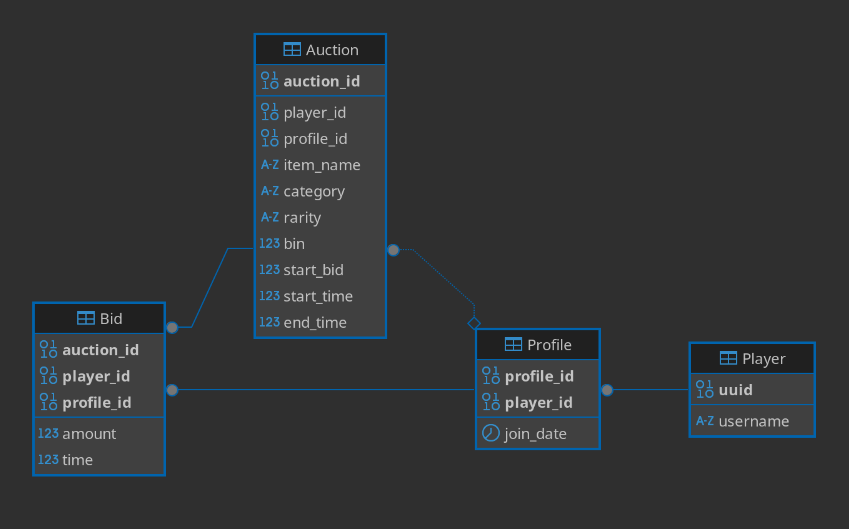

# CS-315 Project Part 2

`streamlit run main.py`

### How to install requirements 
1) Make sure you have an environment folder and `cd` to it
2) `pip install -r requirements.txt`

## Task 1
The insert queries were created with [generate_insert.py](generate_insert.py), which was run separately from main.py. I was using the [Hypixel Public API](https://api.hypixel.net/) to request game data, which is then written into [insert.sql](sql/insert.sql). Unfortunately, the Bid table remains empty, as my API key was (understandably) throttled for spamming too many requests :(

## Task 2

Video attached to D2L assignment.

## Task 3

***
a. This schema is intended to store game data from the Minecraft server Hypixel’s API. The model could be useful for storing player data in any MMO game, especially if more columns were added to the Profile and Player tables to keep complete records of player data. The model could even be adapted to real-life online auction platforms, relating accounts to auctions rather than players in a game. 
***
b. Players can create multiple save slots (or profiles), and may list or bid on auctions from any of those profiles. A profile can also have multiple players, and players on the same profile can see and collect each other’s auctions. Thus, the Profile table is related to Auction, and the Player table to Profile. Each unique auction can have multiple bids, so there is also the Bid table, pointing to the player/profile bidding, and the auction they are bidding on.

If there were more data stored about each profile, such as the date the first member created it, Profile would become a linking table between Player and a new table with profile_id as the grain (as it is a many-to-many relationship), but in this case I am only storing the date each player joined the profile, so it is unnecessary.

I chose this model because I knew I could populate it with real data and learn to make API requests. The game is also an application I am familiar with and enjoy.

***
## Queries:

- [all_auctions.sql](sql/all_auctions.sql) - `INNER JOIN` to get auctions with the player who listed each
- [lowest_bin.sql](sql/lowest_bin.sql) - `WHERE` to get only BIN listings, then `MIN` and `GROUP BY` to get the minimum BIN price for a given `item_name`
- [lbin_by_rarity.sql](sql/lbin_by_rarity.sql) - Uses the previous query as a CTE, then joins the auction table to group by rarity and find average BIN price for each rarity.